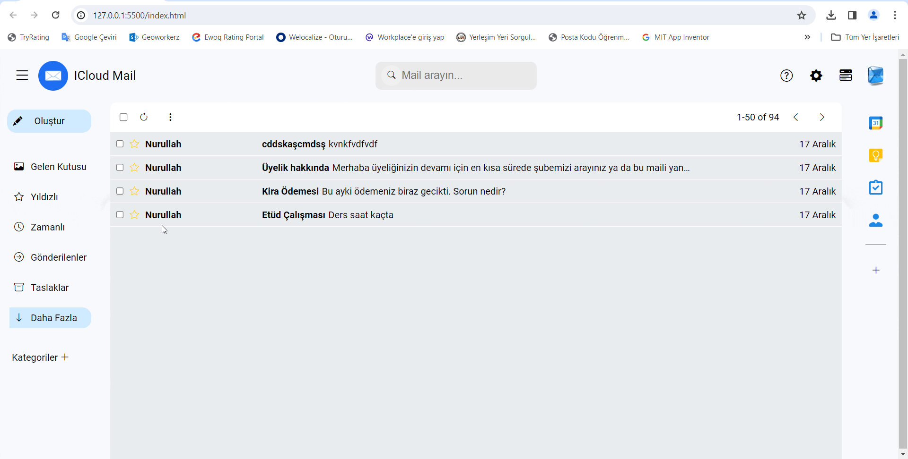

<h1> iCloud Mail</h1> 

iCloud Mail is a web-based email sending and receiving interface developed using HTML5, CSS, and JavaScript.

<h3>Features</h3>

- Send and receive emails.
- Mark emails as starred.
- Email search feature (using the debounce method).
- Email deletion and addition functions.

<h3>Technologies Used</h3> 

- HTML5
- CSS (Styled with Sass and Scss)
- JavaScript

<h3>Usage</h3> 

1. Download the project files to your computer.
2. Navigate to the directory where you downloaded the files.
3. Open the `index.html` file in a web browser.

<h3>Screenshots</h3> 

